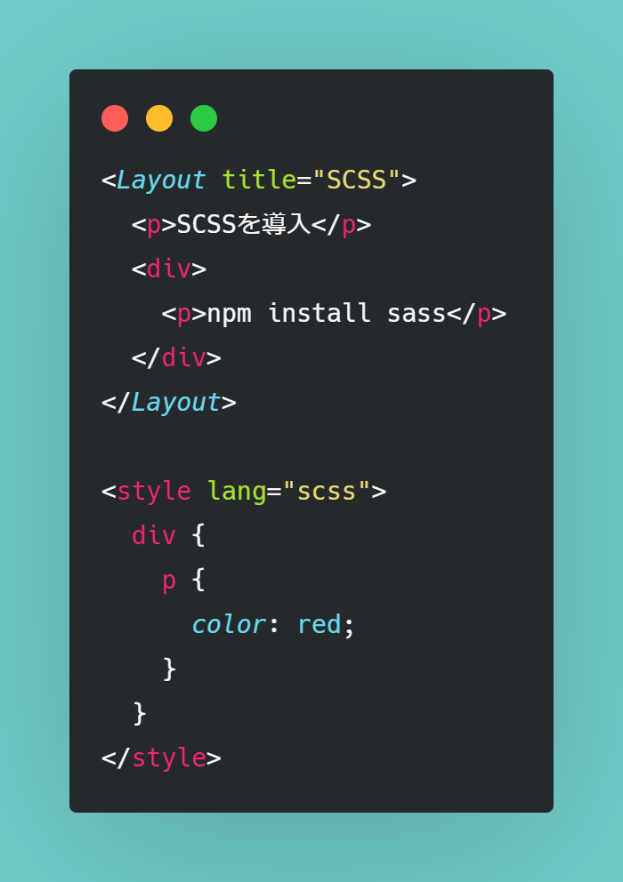
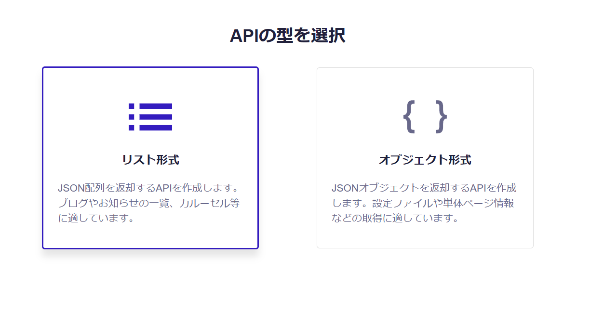
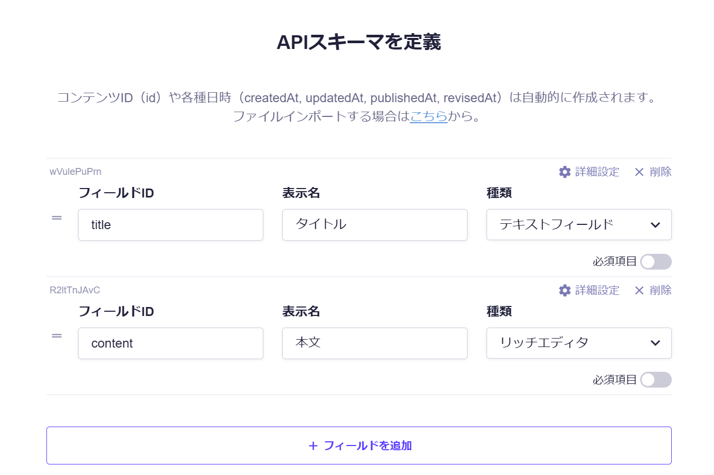
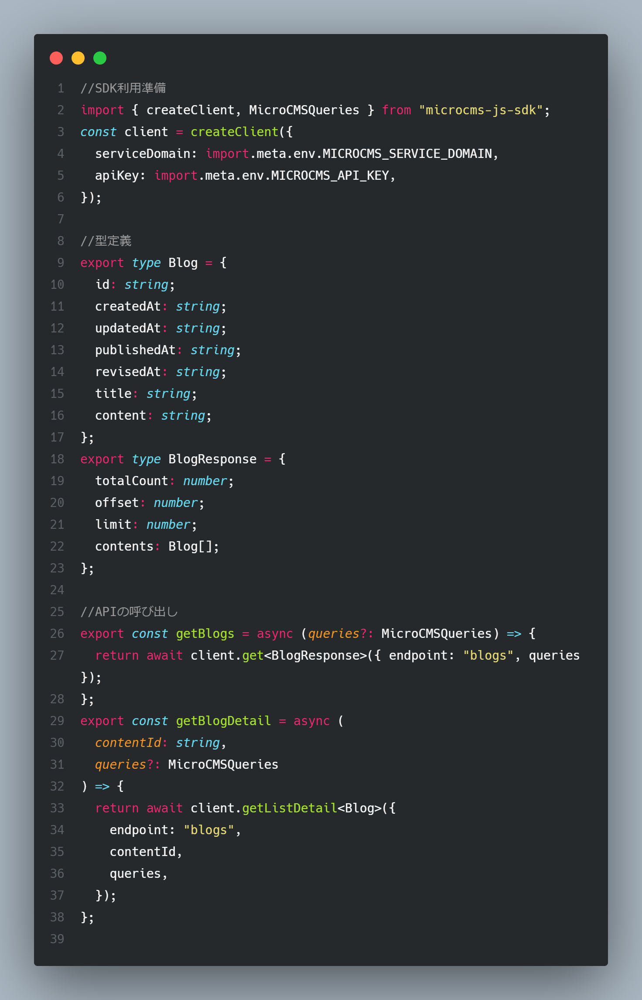
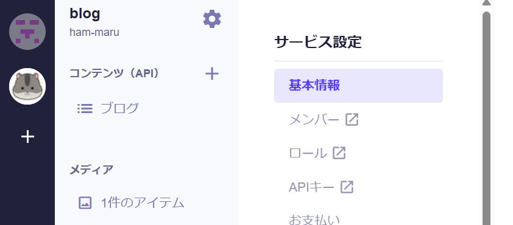
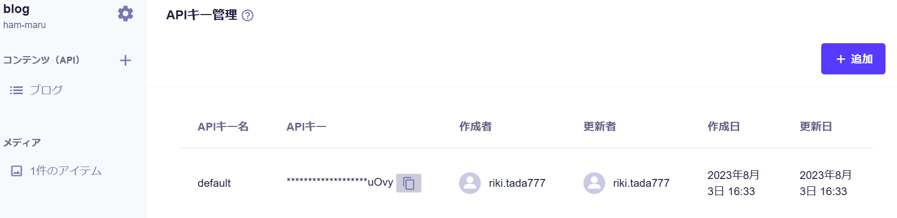
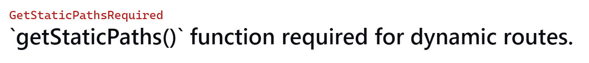

# Astro で Portfolio と Blog を構築

## 目標

- Astro でポートフォリオとブログを構築する
- ブログを microCMS で管理する
- Vercel を使ってデプロイする

## 準備するもの

- astro
- microCMS
- GitHub
- vercel
- vscode

## 手順

1. vscode インストール
2. GitHub アカウント作成
3. astro の環境構築
4. scss インストール
5. vercel インストール
6. microCMS アカウント作成

## 1.vscode インストール

## 5.vercel

[astro に vercel を追加](https://docs.astro.build/ja/guides/deploy/vercel/)

## SCSS

```npm
npm i sass
```



## 6.microCMS

[microCMS => Astro-Blog](https://blog.microcms.io/astro-microcms-introduction/)


src/library/microcms.ts


---

.env
MICROCMS_SERVICE_DOMAIN=<YOUR_SERVICE> //.microcms.io は含まない値
MICROCMS_API_KEY=<YOUR_KEY_VALUE>




## 注意点

1. pages/[blogId].astro を `[blogid].astro` にしていたためエラーが発生。しっかりスネークケースを使用すること。
